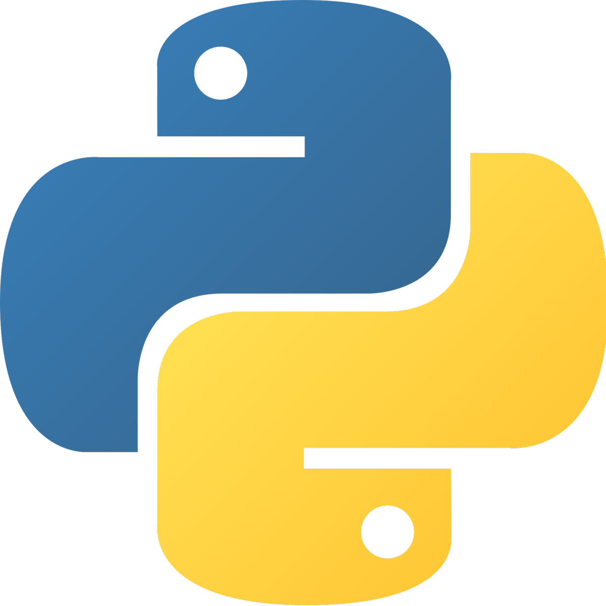

# Hello! 👋
I'm Python, algorithms and machine learning enthusiast ;) 

## Technologies I'm Familiar With
### Backend and General-Purpose Languages:

    
    
    
    
    

### Web Technologies:

    
    
    

If you have something I might find interesting, feel free to contact me here: [mcj.mezyk@gmail.com](mailto:mcj.mezyk@gmail.com)
